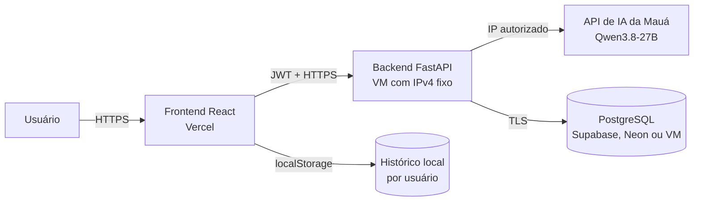

---
aliases:
  - Documentação Mauá AI
  - Projeto Mauá AI
tags:
  - projeto
  - inteligencia-artificial
  - maua
  - chatbot
status: em-desenvolvimento
atualizado: 2026-09-25
---

# Mauá AI — documentação do projeto

> [!abstract] Resumo
> Aplicação web de chatbot acadêmico que conecta alunos à IA executada nos servidores da Mauá. O sistema possui frontend em React, backend em FastAPI, autenticação com JWT e usuários armazenados no PostgreSQL.

## Navegação

- [[01 - Deploy e IP fixo|Deploy, IP fixo e liberação com o professor]]
- [[02 - Migracao para outro PC|Migração e instalação no PC novo]]
- [README técnico](../README.md)
- [Repositório no GitHub](https://github.com/OmarFLK/MAUA_IA)

## Objetivo

Criar uma interface segura e simples para utilizar o modelo de IA disponibilizado pela Mauá em PI, TCC e trabalhos de disciplinas. O navegador nunca acessa diretamente a API institucional: todas as chamadas passam pelo nosso backend autenticado.

## IA utilizada

| Item | Valor atual |
|---|---|
| Modelo principal | `qwen/qwen3.8-27b` |
| Família | Qwen3.8-27B |
| Parâmetros | 27 bilhões |
| Licença informada | Apache 2.0 |
| Contexto informado | 262 mil tokens |
| Multimodal | O modelo aceita texto e imagem; a interface atual usa apenas texto |
| Compatibilidade | API no padrão OpenAI |
| Streaming | SSE, convertido pelo backend para NDJSON no navegador |
| Temperatura padrão | `0.25` |
| Timeout | 120 segundos |

> [!important] Identificador do modelo
> O nome `qwen/qwen3.8-27b` veio da documentação recebida. Quando a Base URL for liberada, devemos consultar `/v1/models` e confirmar o identificador exato antes do teste final.

O modelo utiliza raciocínio intenso por padrão. Para evitar consumo desnecessário de contexto, o sistema inicia no modo rápido enviando `enable_thinking: false`. O usuário pode ativar **Raciocínio profundo** nas configurações do chat.

## Arquitetura



### Por que o backend precisa de IP fixo?

O professor confirmou que a API da Mauá libera acesso por IP. O IP residencial muda, portanto o backend deve rodar em uma VM com **IPv4 público reservado**. A Mauá adiciona esse IP à allowlist e todas as chamadas passam a sair pelo mesmo endereço.

O frontend e o PostgreSQL podem ficar em outros provedores. Apenas o servidor que chama diretamente a API da Mauá precisa ter o IP liberado.

## Tecnologias

### Frontend

- React + TypeScript
- Vite
- React Markdown + GitHub Flavored Markdown
- Lucide Icons
- Histórico salvo no `localStorage`, separado pelo ID do usuário
- Token de sessão salvo no `sessionStorage`

### Backend

- Python + FastAPI
- HTTPX para comunicação e streaming com a Mauá
- SQLAlchemy assíncrono
- JWT para autenticação
- Argon2 para hash das senhas
- Validação com Pydantic

### Dados e infraestrutura

- PostgreSQL para usuários
- Docker Compose para banco local
- Vercel preparada para o frontend
- Backend planejado para uma VM com IPv4 fixo

## Como uma mensagem percorre o sistema

1. O usuário entra ou cria uma conta.
2. O backend confere o PostgreSQL e entrega um token JWT.
3. O frontend envia a pergunta e o token ao endpoint `/api/chat`.
4. O backend valida o usuário.
5. O backend adiciona a instrução de sistema e até 40 mensagens recentes do histórico.
6. A chamada é enviada para `{MAUA_AI_BASE_URL}/chat/completions`.
7. A Mauá responde em streaming.
8. O backend repassa os fragmentos ao navegador conforme chegam.
9. O navegador renderiza Markdown e salva a conversa localmente.

## O que já está pronto

- [x] Interface responsiva do chat
- [x] Streaming das respostas
- [x] Renderização de Markdown, código e tabelas
- [x] Histórico local com várias conversas
- [x] Configuração de temperatura, limite de resposta e raciocínio
- [x] Tela de login e cadastro
- [x] Usuários no PostgreSQL
- [x] Senhas com Argon2
- [x] Sessão JWT e endpoint `/api/auth/me`
- [x] Chat protegido contra acesso sem autenticação
- [x] Históricos locais separados por usuário
- [x] Três contas demonstrativas
- [x] Docker Compose para PostgreSQL local
- [x] Configuração de build do frontend na Vercel
- [x] Nove testes automatizados do backend
- [x] Lint, TypeScript e build de produção validados
- [x] Código versionado no GitHub

## O que ainda falta

> [!todo] Caminho crítico
> Os itens abaixo precisam ser concluídos nesta ordem para testar a IA real.

- [ ] Criar a VM gratuita ou VPS para o backend
- [ ] Reservar um IPv4 público permanente nessa VM
- [ ] Enviar o IPv4 ao professor
- [ ] Receber a Base URL da API da Mauá
- [ ] Confirmar se a Mauá liberou o IP
- [ ] Escolher e criar o PostgreSQL de produção
- [ ] Publicar o backend com HTTPS
- [ ] Configurar os segredos de produção no backend
- [ ] Publicar ou atualizar o frontend na Vercel
- [ ] Configurar `VITE_API_BASE_URL` na Vercel
- [ ] Adicionar o domínio da Vercel em `ALLOWED_ORIGINS`
- [ ] Confirmar o modelo usando `/v1/models`
- [ ] Executar um teste completo de login → pergunta → streaming
- [ ] Desativar e remover as contas demonstrativas antes do uso real

## Contas de desenvolvimento

| Nome | E-mail | Senha |
|---|---|---|
| Ana Silva | `ana@teste.maua.ai` | `Maua@2026` |
| Bruno Santos | `bruno@teste.maua.ai` | `Maua@2026` |
| Carla Oliveira | `carla@teste.maua.ai` | `Maua@2026` |

> [!warning] Produção
> Essas contas são apenas para desenvolvimento. Antes do deploy real, usar `SEED_TEST_USERS=false` e excluir os usuários demonstrativos do banco.

## Onde cada dado fica

| Dado | Local | Observação |
|---|---|---|
| Nome e e-mail | PostgreSQL | Persistentes |
| Senha | PostgreSQL | Somente hash Argon2 |
| Token JWT | `sessionStorage` | Some ao fechar a sessão do navegador |
| Conversas | `localStorage` | Separadas por usuário e por navegador |
| Base URL da Mauá | Variável do backend | Nunca vai para o frontend |
| Segredo JWT | Variável do backend | Nunca deve entrar no Git |
| URL pública do backend | Variável da Vercel | Não é um segredo |

Atualmente as conversas não são salvas no PostgreSQL. Isso simplifica a primeira versão, mas significa que o histórico não acompanha o usuário em outro navegador ou computador.

## Estrutura do repositório

```text
MAUA_IA/
├── backend/
│   ├── auth.py           # cadastro, login, JWT e usuário atual
│   ├── config.py         # variáveis de ambiente
│   ├── database.py       # conexão, sessões e contas de teste
│   ├── main.py           # API, integração com a Mauá e streaming
│   ├── models.py         # tabela de usuários
│   └── test_main.py      # testes automatizados
├── frontend/
│   ├── src/App.tsx       # interface principal do chat
│   ├── src/AuthScreen.tsx# login e cadastro
│   ├── src/api.ts        # endereço público do backend
│   └── src/styles.css    # design responsivo
├── docs/                 # documentação para Obsidian
├── docker-compose.yml    # PostgreSQL local
├── vercel.json           # build do frontend na Vercel
├── .env.example          # modelo das variáveis do backend
└── README.md             # instruções técnicas rápidas
```

## Melhorias futuras

- [ ] Persistir conversas e mensagens no PostgreSQL
- [ ] Recuperação de senha por e-mail
- [ ] Painel administrativo para usuários e consumo
- [ ] Rate limiting por usuário e por IP
- [ ] Refresh token ou sessão por cookie seguro
- [ ] Upload de imagens para usar a capacidade multimodal
- [ ] Métricas de latência, falhas e tamanho das respostas
- [ ] Migrações formais de banco com Alembic
- [ ] Testes ponta a ponta do frontend

## Contatos da Mauá

- Responsável técnico informado: `rodrigo.moreira@maua.br`
- Grupo de suporte: [WhatsApp](https://chat.whatsapp.com/FACq7hfcOAiHz3fl3zrbSR)

---

Próximo passo recomendado: abrir [[01 - Deploy e IP fixo]] e provisionar a VM do backend.

