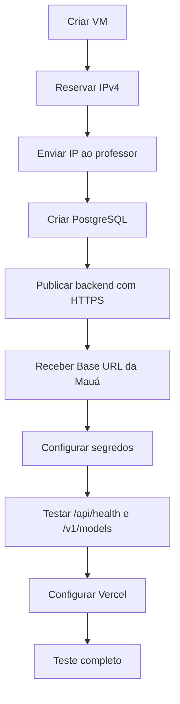

---
tags:
  - projeto
  - deploy
  - infraestrutura
  - maua
status: pendente
atualizado: 2026-09-25
---

# Deploy, IP fixo e liberação com a Mauá

← [[00 - Indice Maua AI|Voltar para a documentação principal]]

## Decisão de arquitetura

| Componente | Hospedagem sugerida | Precisa de IP fixo? |
|---|---|---|
| Frontend React | Vercel | Não |
| Backend FastAPI | Oracle Cloud VM ou VPS | **Sim** |
| PostgreSQL | Supabase, Neon ou PostgreSQL da VM | Não |
| API de IA | Servidor da Mauá | Mantido pela faculdade |

O endereço liberado pela Mauá deve ser o **IPv4 público de saída do backend**. Os IPs dos computadores dos alunos, da Vercel e do banco não precisam entrar na allowlist.

> [!danger] Não publicar o backend atual sem autenticação configurada
> O chat já exige JWT, mas o deploy ainda precisa de HTTPS, segredo JWT forte, CORS restrito e contas demonstrativas desativadas. A API institucional não possui uma chave de autenticação real; um proxy público mal protegido poderia permitir abuso da GPU compartilhada.

## Opção sugerida para o backend

A primeira tentativa pode ser uma VM **Oracle Cloud Always Free**, com um IP público reservado. Se não houver capacidade gratuita disponível, usar uma VPS barata com IPv4 incluso.

Ao criar a VM:

1. Escolher Ubuntu LTS.
2. Criar ou selecionar uma rede pública.
3. Reservar um **IPv4 público persistente**, não somente efêmero.
4. Liberar inicialmente apenas `22`, `80` e `443` no firewall.
5. Anotar o IPv4 público.
6. Enviar esse IPv4 ao professor.
7. Instalar Docker ou Python, proxy HTTPS e o backend.

Links úteis:

- [Oracle Cloud Free Tier](https://www.oracle.com/cloud/free/)
- [Vercel — monorepos](https://vercel.com/docs/monorepos)
- [Supabase](https://supabase.com/)
- [Neon](https://neon.tech/)

## Mensagem pronta para o professor

> Olá, professor. Provisionamos o backend do projeto em uma VM com IPv4 público reservado. O IP de saída que deve ser liberado na allowlist da API é **COLOCAR-IP-AQUI**. Poderia confirmar a liberação e nos encaminhar a Base URL da API OpenAI-compatible? Utilizaremos o modelo Qwen3.8-27B pelo backend do projeto.

## Ordem correta do deploy



## Variáveis do backend

Devem ser configuradas na VM, nunca no frontend:

| Variável | Exemplo | Segredo? |
|---|---|---|
| `MAUA_AI_BASE_URL` | `https://servidor-da-maua/v1` | Sim, tratar como informação interna |
| `MAUA_AI_API_KEY` | `maua` | Baixa sensibilidade, mas fica no backend |
| `MAUA_AI_MODEL` | `qwen/qwen3.8-27b` | Não |
| `MAUA_AI_TIMEOUT_SECONDS` | `120` | Não |
| `DATABASE_URL` | `postgresql+asyncpg://...` | **Sim** |
| `JWT_SECRET` | valor aleatório longo | **Sim** |
| `JWT_EXPIRE_MINUTES` | `480` | Não |
| `SEED_TEST_USERS` | `false` | Não |
| `ALLOWED_ORIGINS` | domínio HTTPS da Vercel | Não |

Para gerar um segredo no servidor:

```bash
openssl rand -hex 32
```

## Variável do frontend na Vercel

```env
VITE_API_BASE_URL=https://api.seu-dominio.com
```

Não adicionar `/api` e não terminar com `/`. Essa variável é incorporada no build, então é necessário fazer redeploy após alterá-la.

## Configuração da Vercel

O repositório contém `vercel.json`, que manda compilar apenas o Vite em `frontend`. Se a Vercel tentar detectar o FastAPI novamente:

1. Abrir **Settings → Build and Deployment**.
2. Definir **Root Directory** como `frontend`.
3. Selecionar o framework **Vite**.
4. Usar `npm run build`.
5. Usar `dist` como Output Directory.
6. Fazer redeploy sem cache.

## PostgreSQL de produção

Há duas opções simples:

### Banco gerenciado

Usar Supabase ou Neon e copiar a connection string para `DATABASE_URL`. É mais simples para backup, TLS e manutenção.

### Banco na mesma VM

Usar o `docker-compose.yml` do projeto. É econômico, mas banco e backend ficam no mesmo servidor; se a VM falhar, os dois ficam indisponíveis. Também exige backup próprio.

## Checklist de segurança

- [ ] HTTPS ativo no backend
- [ ] `JWT_SECRET` aleatório e com pelo menos 32 bytes
- [ ] `SEED_TEST_USERS=false`
- [ ] Usuários de teste removidos do banco
- [ ] `ALLOWED_ORIGINS` contém somente o domínio real do frontend
- [ ] PostgreSQL não está exposto publicamente na porta `5432`
- [ ] Senha forte no PostgreSQL
- [ ] SSH da VM usa chave, não senha simples
- [ ] `.env` permanece fora do Git
- [ ] Logs não exibem tokens, senhas ou connection strings
- [ ] Limite de requisições planejado antes de abrir para muitos usuários

## Teste de produção

1. Abrir `https://api.seu-dominio.com/api/health`.
2. Confirmar `database_ready: true`.
3. Criar uma conta real pela interface.
4. Fazer logout e login novamente.
5. Enviar uma pergunta curta.
6. Confirmar que a resposta aparece em streaming.
7. Verificar se a Mauá enxerga as chamadas saindo do IP reservado.
8. Reiniciar a VM e confirmar que o IP não mudou.

## Problemas comuns

| Sintoma | Causa provável | Correção |
|---|---|---|
| `401` | JWT ausente ou expirado | Entrar novamente |
| `503` sobre banco | `DATABASE_URL` inválida ou banco offline | Conferir conexão e firewall |
| `503` sobre Mauá | Base URL ainda não configurada | Definir `MAUA_AI_BASE_URL` |
| Erro de CORS | Domínio da Vercel não autorizado | Atualizar `ALLOWED_ORIGINS` e reiniciar |
| Timeout | Fila na GPU ou rede | Manter 120 s e tentar novamente |
| Resposta vazia | Histórico grande ou raciocínio excessivo | Nova conversa e modo rápido |
| Frontend abre, login falha | `VITE_API_BASE_URL` ausente/incorreta | Corrigir a variável e redeployar |

