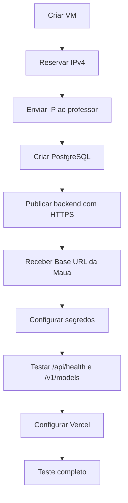

---
tags:
  - projeto
  - deploy
  - infraestrutura
  - maua
status: pendente
atualizado: 2026-10-02
---

# Deploy do backend com a API Barô

> Atualização: a integração atual usa `BARO_API_KEY` e não depende da antiga allowlist de IP. As orientações de IP fixo abaixo descrevem somente a infraestrutura anterior e não devem ser aplicadas à API Barô.

← [[00 - Indice Maua AI|Voltar para a documentação principal]]

> [!important] Situação atual
> A rede da Mauá está autorizada segundo o professor. Outras origens, incluindo casa e nuvem, dependem de autorização específica. Para levar o notebook à faculdade ou alternar redes, veja [uso em redes e IPs diferentes](03%20-%20Uso%20em%20redes%20e%20IPs%20diferentes.md). Não é necessário fazer deploy para testar localmente na rede autorizada.

## Decisão de arquitetura

| Componente | Hospedagem sugerida | Precisa de IP fixo? |
|---|---|---|
| Frontend React | Vercel | Não |
| Backend FastAPI | VM/VPS ou serviço com saída estável | Saída autorizada e previsível para operação contínua |
| PostgreSQL | Supabase, Neon ou PostgreSQL da VM | Não |
| API de IA | Servidor da Mauá | Mantido pela faculdade |

O endereço liberado pela Mauá deve ser o **IPv4 público de saída do backend**. Quando o backend está na nuvem, os IPs dos computadores dos alunos, da Vercel e do banco não precisam entrar na allowlist. Quando ele roda no notebook, vale a saída da rede em que o notebook está conectado.

> [!danger] Não publicar o backend atual sem autenticação configurada
> O chat já exige JWT, mas o deploy ainda precisa de HTTPS, segredo JWT forte, CORS restrito e contas demonstrativas desativadas. A API institucional não possui uma chave de autenticação real; um proxy público mal protegido poderia permitir abuso da GPU compartilhada.

## Opção sugerida para o backend

Escolha um provedor que ofereça saída estável e compatível com a política de autorização da Mauá. Confirme custos, capacidade, persistência do IP e eventuais serviços de NAT antes de contratar. Não presuma gratuidade ou disponibilidade permanente. O guia de redes explica também a saída compartilhada do Render e a diferença entre entrada e saída.

Ao criar a VM:

1. Escolher Ubuntu LTS.
2. Criar ou selecionar uma rede pública.
3. Reservar um **IPv4 público persistente**, não somente efêmero.
4. Liberar inicialmente apenas `22`, `80` e `443` no firewall.
5. Anotar o IPv4 público.
6. Enviar esse IPv4 ao professor.
7. Instalar Docker ou Python, proxy HTTPS e o backend.

Links úteis:

- [Oracle Cloud Free Tier](https://www.oracle.com/cloud/free/)
- [Vercel — monorepos](https://vercel.com/docs/monorepos)
- [Supabase](https://supabase.com/)
- [Neon](https://neon.tech/)

## Mensagem pronta para o professor

> Olá, professor. Validamos localmente o acesso ao Gemma 3 27B pela rede da Mauá. Para publicar o backend, provisionamos uma VM com IPv4 público reservado. O IP de saída que deve ser adicionado à allowlist é **COLOCAR-IP-AQUI**. Poderia confirmar a liberação desse endereço externo?

## Ordem correta do deploy


```mermaid
flowchart TD
    A[Criar VM] --> B[Reservar IPv4]
    B --> C[Enviar IP ao professor]
    C --> D[Criar PostgreSQL]
    D --> E[Publicar backend com HTTPS]
    E --> F[Receber Base URL da Mauá]
    F --> G[Configurar segredos]
    G --> H[Testar /api/health e /v1/models]
    H --> I[Configurar Vercel]
    I --> J[Teste completo]
```

## Variáveis do backend

Devem ser configuradas na VM, nunca no frontend:

| Variável | Exemplo | Segredo? |
|---|---|---|
| `BARO_BASE_URL` | `https://ia.maua.br/api/v1` | Não |
| `BARO_API_KEY` | preencher com sua chave pessoal | **Sim**, somente no ambiente do backend |
| `BARO_MODEL` | `google/gemma-3-27b` | Não |
| `BARO_SUPPORTS_THINKING` | `false` | Não |
| `BARO_TIMEOUT_SECONDS` | `120` | Não |
| `DATABASE_URL` | `postgresql+asyncpg://...` | **Sim** |
| `JWT_SECRET` | valor aleatório longo | **Sim** |
| `JWT_EXPIRE_MINUTES` | `480` | Não |
| `SEED_TEST_USERS` | `false` | Não |
| `ALLOWED_ORIGINS` | domínio HTTPS da Vercel | Não |

Para gerar um segredo no servidor:

```bash
openssl rand -hex 32
```

## Variável do frontend na Vercel

```env
VITE_API_BASE_URL=https://api.seu-dominio.com
```

Não adicionar `/api` e não terminar com `/`. Essa variável é incorporada no build, então é necessário fazer redeploy após alterá-la.

## Configuração da Vercel

O repositório contém `vercel.json`, que manda compilar apenas o Vite em `frontend`. Se a Vercel tentar detectar o FastAPI novamente:

1. Abrir **Settings → Build and Deployment**.
2. Definir **Root Directory** como `frontend`.
3. Selecionar o framework **Vite**.
4. Usar `npm run build`.
5. Usar `dist` como Output Directory.
6. Fazer redeploy sem cache.

## PostgreSQL de produção

Há duas opções simples:

### Banco gerenciado

Usar Supabase ou Neon e copiar a connection string para `DATABASE_URL`. É mais simples para backup, TLS e manutenção.

### Banco na mesma VM

Usar o `docker-compose.yml` do projeto. É econômico, mas banco e backend ficam no mesmo servidor; se a VM falhar, os dois ficam indisponíveis. Também exige backup próprio.

## Checklist de segurança

- [ ] HTTPS ativo no backend
- [ ] `JWT_SECRET` aleatório e com pelo menos 32 bytes
- [ ] `SEED_TEST_USERS=false`
- [ ] Usuários de teste removidos do banco
- [ ] `ALLOWED_ORIGINS` contém somente o domínio real do frontend
- [ ] PostgreSQL não está exposto publicamente na porta `5432`
- [ ] Senha forte no PostgreSQL
- [ ] SSH da VM usa chave, não senha simples
- [ ] `.env` permanece fora do Git
- [ ] Logs não exibem tokens, senhas ou connection strings
- [ ] `APP_ENVIRONMENT=production`, sem endpoint de inspeção de sessões
- [ ] Limite de requisições planejado antes de abrir para muitos usuários

## Teste de produção

1. Abrir `https://api.seu-dominio.com/api/health`.
2. Confirmar `database_ready: true`.
3. Criar uma conta real pela interface.
4. Fazer logout e login novamente.
5. Enviar uma pergunta curta.
6. Confirmar que a resposta aparece em streaming.
7. Verificar se a Mauá enxerga as chamadas saindo do IP reservado.
8. Reiniciar a VM e confirmar que o IP não mudou.

## Problemas comuns

| Sintoma | Causa provável | Correção |
|---|---|---|
| `401` | JWT ausente ou expirado | Entrar novamente |
| `503` sobre banco | `DATABASE_URL` inválida ou banco offline | Conferir conexão e firewall |
| `503` sobre Barô | Chave ainda não configurada | Definir `BARO_API_KEY` |
| Erro de CORS | Domínio da Vercel não autorizado | Atualizar `ALLOWED_ORIGINS` e reiniciar |
| Timeout | Fila na GPU ou rede | Manter 120 s e tentar novamente |
| Resposta vazia | Histórico grande ou limite insuficiente | Nova conversa ou aumentar o limite da resposta |
| Frontend abre, login falha | `VITE_API_BASE_URL` ausente/incorreta | Corrigir a variável e redeployar |

